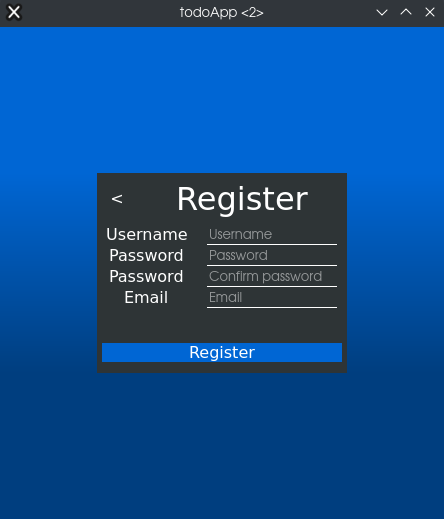
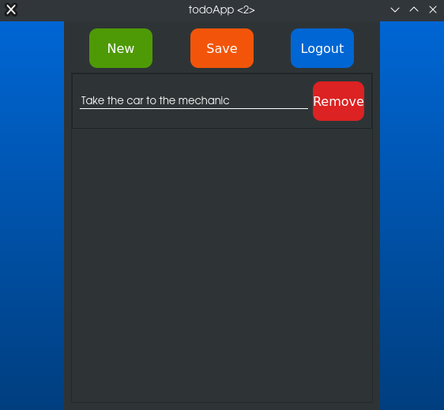

# Todo App - Desktop

Todo app made with PyQt/Pyside2, desktop version of [Todo App - Web](https://github.com/gilsongindrejr/TodoApp-Web).

# Table of contents
- [About the project](#about-the-project)
  - [Features](#features)
  - [Build with](#build-with)
- [Getting started](#getting-started)
- [Usage](#usage)
  
## About the project
App made to learn PyQt/PySide2 and development of desktop apps.

### Features
- Create tasks
- Set task date and time
- Update task
- Tasks are saved in registered account
  
### Build with
- [Python](https://www.python.org) - A high level programming language.
- [SQLite](https://www.sqlite.org/index.html) - Small and self contained SQL database.
- [PySide2](https://doc.qt.io/qtforpython-5/quickstart.html) - The official Python bindings for Qt.

## Getting started


### Create the virtual enviroment
```
$ python -m venv venv
```

### Activate the virtual enviroment
```
$ source venv/bin/activate
```

### Install requirements
```
$ pip install -r requirements.txt
```

### Run the app
```
$ python main.py
```

## Usage

### Create an account

Fill the needed info to create an account.



### Login

Log in using the created account


### Click ```New``` to create a new task.


### Type the task and click ```Save```.



